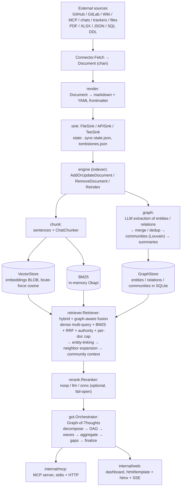

# kb — universal GraphRAG knowledge base

[](https://github.com/alterfo/kb/actions/workflows/ci.yml)

`kb` is a self-contained Go prototype of a graph-aware retrieval-augmented
knowledge base over code, documents, tasks, and chats. It is a single point of
retrieval and answer synthesis over heterogeneous sources of an organization or
project: the only runtime dependency is an OpenAI-compatible LLM endpoint
(chat completions at `/v1/chat/completions` and embeddings at `/v1/embeddings`),
and all persistence (vectors + knowledge graph + metadata) lives in one SQLite
file. `kb` does not bundle or launch a model server — you operate the endpoint.

The engine was redesigned from scratch (no data or code is carried over from
the previous Python prototype) and is deliberately generic: GitHub, GitLab,
wikis, MCP servers, chats, task trackers, and file importers, with a real
knowledge graph on top of hybrid vector search.

## Requirements

- **Go 1.26+** to build from source (or use a prebuilt release binary).
- **An OpenAI-compatible LLM endpoint** that *you* operate, exposing chat
  completions at `/v1/chat/completions` and embeddings at `/v1/embeddings`.
  `kb` does not include or start a model server — the inference infrastructure is
  entirely on your side. Any OpenAI-compatible backend works (for example a local
  local model server (for example vLLM), or a hosted API), as long as it serves those two paths.
- **`jq`** (optional) only for the JSONL demo used by `kb bench`.
- **OS**: macOS, Linux, or Windows. Persistence is a single SQLite file; no other
  services to run.

## Quickstart

Point `kb` at your OpenAI-compatible endpoint, build, and serve:

```sh
git clone https://github.com/alterfo/kb.git
cd kb
make build
export KB_LLM_BASE_URL=http://<your-llm-host>:11434   # chat + completions
export KB_EMBED_BASE_URL=http://<your-llm-host>:11434  # embeddings (same host is fine)
export KB_LLM_MODEL=qwen3.8:latest
export KB_EMBED_MODEL=qwen3-embedding
./bin/kb serve
```

`kb` reads its configuration from the environment (see Configuration below) or a
local `.env` file — only the endpoint URL, model names, and storage paths are
required. Nothing else needs to be launched.

Or install the latest release directly:

```sh
go install github.com/alterfo/kb/cmd/kb@latest
```

Open http://127.0.0.1:8080. The dashboard intentionally binds only to loopback
addresses and has no authentication, so keep it local or put it behind an SSH
tunnel or authenticating reverse proxy. See Configuration below for the full
environment surface and Usage for each CLI command.

## Architecture



Persistence is a single file `$PERSIST_DIR/kb.db`: vector tables (`chunks`),
graph tables (`entities`/`relations`/`communities`), `kb_meta`/`corpus_version`,
and `search_history`/`ask_runs` (dashboard search and ask history) in one SQLite
database. The BM25 index is in-memory only and is rebuilt from `chunks`
whenever `corpus_version` changes.

See `docs/architecture.md` for the pipeline in detail.
See `docs/architecture-review.md` for the architectural review, strengths,
risks, and public-release readiness checklist.

## Stack

| Layer | Choice |
|---|---|
| Vector store | `ncruces/go-sqlite3` (pure Go, no cgo), brute-force cosine over BLOBs |
| Graph store | same SQLite file (`entities`/`relations`/`communities` tables) |
| Lexical search | in-memory Okapi BM25, tokenizer `[\p{L}\p{N}]+` (Cyrillic-safe) |
| Community detection | `gonum.org/v1/gonum/graph/community` (Louvain) |
| Sentence splitting | `neurosnap/sentences` (Punkt, RU/EN) |
| Token counting | stdlib heuristic (rune count / 4) |
| LLM + embeddings | custom OpenAI-compatible client (`/v1/embeddings`, `/v1/chat/completions`) with proxy-bypass, retry, SSE streaming |
| MCP | `modelcontextprotocol/go-sdk` |
| Web | stdlib `net/http` + `html/template` + vendored htmx, SSE, vendored Cytoscape.js (graph canvas) |
| HTTP connectors | shared `transport.Client` (pagination, retry/backoff, ratelimit, ETag, no-proxy, SOCKS5 via `KB_SOCKS_PROXY`) |
| Files | PDF (pure-Go + `pdftotext` fallback), XLSX (`xuri/excelize/v2`), JSON (`tidwall/gjson`), hand-written SQL DDL parser |

## Repository layout

- `cmd/kb` — CLI: `sync`, `reindex`, `doctor`, `serve`, `mcp`, `plan`, `describe`, `verify`, `bench`, `bench-dragon`
- `internal/config` — env loading + `sources.yaml` (secret env-var *names* only)
- `internal/llm` — LLM client (chat, chat stream, embeddings, dim probe)
- `internal/store/{sqlite,vector,graphstore,bm25,history}` — persistence
  (`history` — search/ask history, backing the dashboard's search/ask history
  pages)
- `internal/engine/{chunk,retriever,rerank,got}` — chunking, hybrid+graph retrieval, rerank, Graph-of-Thoughts
- `internal/engine/report` — answer synthesis and global GraphRAG reports
- `internal/graph` — LLM extraction (generic + legal + chat), merge/dedup, communities, summaries, `codegraph` (deterministic Go code graph)
- `internal/governance` — corpus governance (scan, retention, trash)
- `internal/connector` + `internal/connectors/*` — connector contract, registry, implementations
- `internal/transport` — shared HTTP client
- `internal/state` — `.sync-state.json` (cursor advance-on-success + rollback), tombstones
- `internal/render` — Document → markdown + YAML frontmatter (golden tests)
- `internal/markdown` — HTML → Markdown conversion used by the `rss` and `web` connectors
- `internal/sink` — `FileSink` (default) | `APISink` | `TeeSink`
- `internal/importer/{pdf,xlsx,jsonf,sqlddl,legalru,code}` — file importers
- `internal/verify` — golden-graph diff, citation checks, contradiction detection, `legaleval` (legal faithfulness metrics), `qa` (Leon issue Q&A evals)
- `internal/ingest` — ingest driver loop (used by `cmd/kb sync`)
- `internal/mcp` — MCP server (search, ask, get_document, list_sources, add_note, add_source, graph_query, generate_report, reindex, status)
- `internal/web` — dashboard (search + history, ask with SSE + history, documents + graph
  relationships, integrations, reports, interactive graph (Cytoscape.js), MCP info page,
  cleanup, trash)
- `internal/planner` — agentic plan execution loop for `kb plan`

## Configuration

Copy `.env.example` to `.env` and adjust as needed (or export the variables
directly). Most settings have defaults and live in `internal/config/env.go`;
connector-level options such as `KB_SOCKS_PROXY` are read directly by the
connector that needs them (Discord).

| Variable | Default | Meaning |
|---|---|---|
| `KB_ROOT` | `./kb_root` | Root directory for ingested markdown documents |
| `PERSIST_DIR` | `./kb_root/.persist` | Directory for `kb.db`, `.sync-state.json`, tombstones |
| `KB_LLM_BASE_URL` | `http://127.0.0.1:11434` | OpenAI-compatible endpoint base URL for the chat/completions model (entity/relation extraction, answer synthesis, rerank). Point at your model host. |
| `KB_EMBED_BASE_URL` | `http://127.0.0.1:11434` | Query-time embeddings (retrieval) — same host as `KB_LLM_BASE_URL` is fine. |
| `KB_EMBED_INDEX_BASE_URL` | `KB_LLM_BASE_URL` | Bulk indexing embeddings — defaults to the chat endpoint. |
| `KB_LLM_MODEL` | `qwen3.8:latest` | Chat model |
| `KB_EMBED_MODEL` | `qwen3-embedding` | Embeddings model (must support embeddings) |
| `KB_HYBRID` | `true` | Hybrid retrieval (dense + BM25 + RRF); `false` = dense-only |
| `KB_RERANK` | `off` | Reranker: `off` \| `llm` \| `onnx` |
| `KB_AUTHORITY_BONUS` | `notes/=0.15,notes/approved/=0.30` | Authority prior bonuses, `prefix=bonus,...` |
| `KB_NO_PROXY` | `127.0.0.1` | Comma-separated hosts that bypass HTTP(S)_PROXY (direct connection) |
| `KB_TOP_K` | `10` | Default top-K retrieval results |
| `KB_CHUNK_SIZE` | `4096` | Chunk size (tokens) |
| `KB_CHUNK_OVERLAP` | `512` | Chunk overlap (tokens) |
| `KB_RRF_K` | `60` | Reciprocal Rank Fusion constant |
| `KB_CANDIDATE_K` | `20` | Per-leg candidate window before fusion (bench tuning) |
| `KB_PER_DOC_CAP` | `2` | Max chunks per document in fused results |
| `KB_SET_MAX_ROUNDS` | `3` | Max query-variant rounds for set/count retrieval (`ModeSet`) |
| `KB_QUALIFIER_FILTER` | `false` | Extract structured metadata qualifiers from the question via one LLM call and filter every retrieval leg |
| `KB_ABSTAIN_THRESHOLD` | (off) | Float in `(0,1]`: answer "not found" when every subgoal is uncovered and average coverage is below the threshold |
| `KB_SUPERSEDE_MODE` | `soft` | `soft` = rank superseded docs lower; `strict` = drop a superseded doc from synthesis when its replacement is retrieved |
| `KB_INTRA_DOC_BUDGET` | (off) | Approx token budget for pulling sibling sections of winning documents into results (intra-document questions) |
| `KB_STALE_AFTER` | `24h` | Sync staleness threshold for `doctor` / `/integrations` |
| `KB_COMMUNITY_ALGO` | `louvain` | Community detection: `louvain` \| `leiden` (Leiden is hierarchical) |
| `KB_LLM_TIMEOUT` | `60s` | Request timeout for embed + chat calls to the endpoint |
| `KB_MAX_SUBGOALS` | `5` | Max GoT subgoals per question; lower cuts per-question LLM calls at some recall cost |
| `KB_MAX_GAP_QUERIES` | `3` | Max GoT gap-refine queries per question; lower cuts per-question LLM calls |
| `KB_DESCRIBE_MODEL` | `qwen3.8:latest` | Chat model used by `kb describe` (independent of `KB_LLM_MODEL`) |
| `KB_DESCRIBE_BATCH` | `10` | Batch size for `kb describe` summary generation |
| `KB_SOCKS_PROXY` | (unset) | SOCKS5 proxy (`socks5://host:port`) used by connectors that need it (e.g. Discord) |

Connector instances are declared in `$KB_ROOT/sources.yaml`. The file stores
only the *names* of environment variables that hold secrets; values are read
from the process environment at resolve time and never written to disk.
Format and per-connector options: `docs/sources.md`.

## Usage

```sh
go build -o bin/kb ./cmd/kb
```

### doctor

Health and sync-health report: LLM endpoint reachability (embed dimension + chat
round-trip), index version/dimension, and a presence-only per-source report
(which secret env vars are set, last sync time, staleness vs `KB_STALE_AFTER`,
last sync error).

```sh
./bin/kb doctor
```

### sync

Runs the configured connectors and writes documents to `KB_ROOT` via the sink.
Cursor is advance-on-success with rollback; tombstones prevent re-import of
deleted items; prune happens only on full reconcile.

```sh
./bin/kb sync --all            # all sources from sources.yaml
./bin/kb sync --source=NAME    # only the named source
./bin/kb sync --all --api=http://127.0.0.1:8321   # push to a running server (POST /documents) instead of writing files
```

`--api` mode indexes documents in the server without writing files; API-fed
documents are kept across `kb reindex` (full reindex garbage-collects only
filesystem-backed docs that no longer exist). Chat messages are indexed
one message at a time in this mode, so reply chains are chunked per message
rather than glued into a single thread chunk — run a file-based sync or a
full reindex for thread glueing.

### reindex

Rebuilds the vector + graph index from the documents under `KB_ROOT`
(chunking → embeddings → LLM graph extraction → communities → summaries).
Optional positional argument restricts reindexing to a subpath. A document
whose content is unchanged since the last successful index is skipped
(content-hash check) — a repeat `reindex` only pays the embed/LLM cost for
files that actually changed. Output reports `indexed`/`skipped`/`removed`
counts.

```sh
./bin/kb reindex [subpath]
./bin/kb reindex --reembed   # clear stored embeddings + dimension, re-embed from scratch
```

`--reembed` clears stored embeddings and the stored dimension before
reindexing — use it when switching `KB_EMBED_MODEL` or recovering from an
`ErrDimMismatch`.

### describe

Walks the corpus for documents without a `summary` frontmatter key and
generates a short description via the LLM (fail-open, in batches), writing it
back through the sink + indexer and refreshing BM25. Documents that already
have a summary are skipped. If the LLM is unreachable, generation falls back to
the first ~200 characters of the first meaningful sentence of the body.

```sh
./bin/kb describe [--source NAME]   # only describe documents from one source
```

Settings: `KB_DESCRIBE_MODEL` (default `qwen3.8:latest`) and
`KB_DESCRIBE_BATCH` (default 10).

### verify

Runs Q&A evals over a golden set built from closed Leon issues
(`question = issue title`, `expected = issue body`): retrieval + synthesis
answers are judged by an LLM with an offline overlap fallback (fail-open), and
a report with pass rate and per-source hit rate is written to
`PERSIST_DIR/last-qa-report.json`.

```sh
./bin/kb verify [--pairs testdata/leon-qa/qa_pairs.json] [--limit N]
./bin/kb verify --build-golden [--source leon-ai] [--golden-out testdata/leon-qa/qa_pairs.json]
./bin/kb verify --top-k 8 --report $PERSIST_DIR/last-qa-report.json
```

Flags: `--pairs` (golden input path, default `testdata/leon-qa/qa_pairs.json`),
`--build-golden` (rebuild the golden set from `KB_ROOT`), `--golden-out`
(golden output path), `--report` (eval report path, default
`$PERSIST_DIR/last-qa-report.json`), `--source` (source filter for
`--build-golden`, default `leon-ai`), `--limit` (evaluate the first N pairs),
`--top-k` (chunks retrieved per question, default `KB_TOP_K`).

### EnterpriseRAG-Bench (`kb bench`)

Run the [EnterpriseRAG-Bench](https://github.com/onyx-dot-app/EnterpriseRAG-Bench)
question set (500 questions, 10 categories) against the kb pipeline and emit a
leaderboard-ready submission:

```sh
unzip all_documents.zip -d /data/erb/corpus
./bin/kb bench \
  --corpus /data/erb/corpus \
  --questions questions.jsonl \
  --out answers.jsonl \
  --limit 50 --types constrained,conflicting_info,completeness,info_not_found
```

Outputs: `answers.jsonl` in the official submission format
(`{"question_id","answer","document_ids"}`) plus a per-type metrics report
(`*.report.json`) with document recall vs gold docs, abstention share and
citation coverage. Bench-specific knobs: `KB_QUALIFIER_FILTER`,
`KB_SUPERSEDE_MODE`, `KB_ABSTAIN_THRESHOLD`, `KB_SET_MAX_ROUNDS`,
`KB_CANDIDATE_K`, `KB_PER_DOC_CAP`, `KB_INTRA_DOC_BUDGET` (see table above).
The command needs a live LLM endpoint.

#### Comparing embedders (RU vs EN)

To check whether swapping the embedding model improves Russian retrieval
without regressing English, use the checked-in bilingual dataset
(`testdata/lang-bench`: 16 docs and 20 questions tagged `language: "ru"` or
`"en"`):

```sh
KB_EMBED_MODEL=qwen3-embedding ./bin/kb bench \
  --corpus testdata/lang-bench/corpus \
  --questions testdata/lang-bench/questions.jsonl \
  --out /tmp/baseline.jsonl

# swap the embedder, then re-run
KB_EMBED_MODEL=<new-model> ./bin/kb bench \
  --corpus testdata/lang-bench/corpus \
  --questions testdata/lang-bench/questions.jsonl \
  --out /tmp/candidate.jsonl

./bin/kb bench compare \
  /tmp/baseline.jsonl.report.json \
  /tmp/candidate.jsonl.report.json
```

`bench compare` prints signed per-language and per-type deltas (candidate minus
baseline) for recall, abstention, and citation coverage; add `--out delta.json`
to also write the comparison as JSON. Each run reindexes the supplied `--corpus`
from scratch into an isolated temporary database using `KB_EMBED_MODEL`, so no
manual reindex is needed; embedding dimension mismatches still fail loudly by
design.

### DRAGON RU RAG-Bench (`kb bench-dragon`)

Run kb over the Russian [DRAGON](https://github.com/RussianNLP/DRAGON) RAG
benchmark (`ai-forever/rag-bench-public-texts` — 526 news articles,
`ai-forever/rag-bench-public-questions` — 600 questions), fetched directly from
HuggingFace, indexed into an isolated temporary database, and answered through
the full GraphRAG + Graph-of-Thoughts pipeline:

```sh
./bin/kb bench-dragon --limit 5           # quick smoke run

# full 526-doc / 600-question run
./bin/kb bench-dragon --out answers.dragon.json --concurrency 3
```

Output: `answers.dragon.json`, a `{question_id: {found_ids, model_answer}}`
map in the exact shape DRAGON's official evaluator expects for a leaderboard
submission. This is a **self-run submission file**, not an official DRAGON
score — the public question set ships without gold answers, so grading happens
only when the file is submitted to the DRAGON maintainers. A committed sample
run lives at `docs/bench/dragon-answers.json` (full 600-question set, indexed
with graph extraction on). Flags: `--limit` (cap the question count),
`--concurrency` (parallel questions), `--top-k` (chunks per subgoal, default
`KB_TOP_K`), `--hf-base-url` (override the HuggingFace datasets-server
endpoint, mainly for testing). The command needs a live LLM endpoint and
network access to `datasets-server.huggingface.co`.

The `verify` command needs a live LLM endpoint (retrieval + synthesis);
integration tests for the QA harness are gated behind
`-tags integration` + `KB_LLM_IT=1`.

### serve

Starts the web dashboard (`internal/web`):

- **Search** — synthesized answers, htmx loading indicator, persistent search
  history (survives restart) shown on `/search`; clicking a history entry opens
  its saved answer via `/search?id=<id>` without re-running retrieval, with a
  re-run button.
- **Ask** (Graph-of-Thoughts, SSE progress) — LogicRAG-style adaptive
  reasoning: decomposition into a dependency DAG, topological wave scheduling,
  a greedy forward pass that injects resolved dependency answers, bounded
  rolling memory (`KB_ASK_ROLLING_WINDOW`), and one dynamic gap-expansion
  round; progress renders as a structured list of steps
  (type/status/stage/answer), not raw JSON; runs persist to SQLite, so
  `/ask/history` lists past and in-flight runs and a run started before a
  restart still shows its last known state instead of an empty page.
- **Documents** — summary list, edit form, htmx delete; `/documents/view` shows
  a document's graph relationships (entities/relations whose source chunks
  overlap the document), not just its raw content.
- **Integrations** — add/edit/delete source instances in `sources.yaml`.
- **Graph** — interactive canvas (Cytoscape.js, vendored, zoom/pan/drag) fed by
  a paginated/filtered `/graph/data` JSON endpoint (search, community, type,
  min-degree filters) instead of dumping the whole graph as static SVG; entity/
  relation CRUD unchanged, click a node to open its edit panel.
- **MCP** — `/mcp/info` shows the live HTTP endpoint, the full tool list, and
  copy-paste client config for both the stdio and HTTP transports.
- Reports, cleanup, and trash routes.

```sh
./bin/kb serve                 # default 127.0.0.1:8080
./bin/kb serve -addr 127.0.0.1:9000   # custom listen address
```

`serve` only binds to loopback addresses: the dashboard has no
authentication and exposes destructive routes, so remote exposure must go
through an SSH tunnel or a reverse proxy.

### mcp

Exposes the knowledge base over the Model Context Protocol
(`internal/mcp`): `search`, `ask`, `get_document`, `list_sources`, `add_note`,
`add_source`, `graph_query`, `generate_report`, `reindex`, `status`.

Two transports:

- **stdio** — `kb mcp`, for local process integration (Claude Desktop, Claude Code).
- **HTTP** — mounted at `/mcp` inside `kb serve` (same tool set, streamable HTTP
  transport), for remote/networked MCP clients. The dashboard's `/mcp/info` page
  shows the live endpoint URL, the full tool list, and copy-paste client config
  for both transports.

```sh
./bin/kb mcp
```

### plan

Agentic plan execution loop: `kb plan` runs a Markdown plan file through an
LLM-driven execution loop (bash/tool calls, signal handling) and commits progress.

```sh
./bin/kb plan <plan>.md
./bin/kb plan --new "<description>"   # create a new plan
./bin/kb plan --no-commit <plan>      # dry-run without commits
./bin/kb plan --max-iterations N <plan>  # cap the execution loop (default 50)
```

Environment overrides: `KB_PLAN_BASE_URL`, `KB_PLAN_API_KEY`, `KB_PLAN_MODEL`,
`KB_PLAN_DIR`, `KB_PLAN_PROGRESS_DIR`.

## Connectors

Registered types (in `internal/connectors/registry`, wired in `cmd/kb/connectors.go`):

| Type | Source | Notes |
|---|---|---|
| `github` | GitHub org or explicit repos | issues, PRs, contents, wiki |
| `gitlab` | GitLab group or projects | issues, MRs, wikis, files |
| `wiki` | MediaWiki or Confluence Cloud | `config.variant: mediawiki\|confluence` |
| `mcp` | MCP server | stdio or HTTP transport |
| `telegram` | Telegram chats | bot token |
| `slack` | Slack channels | bot token |
| `mattermost` | Mattermost team/channels | base URL + token |
| `yandex-tracker` | Yandex Tracker queues | OAuth token + org id |
| `youtrack` | YouTrack projects | base URL + token |
| `kaiten` | Kaiten spaces | base URL + token |
| `weeek` | Weeek spaces | token |
| `searchapi` | Generic search API | configurable fields/pagination/auth |
| `discord` | Discord guild channels | bot token; optional SOCKS via `KB_SOCKS_PROXY` |
| `trello` | Trello board | public export, or API key/token for private boards |
| `rss` | RSS 2.0 feed | `config.feed_url` |
| `web` | Website via sitemap or explicit pages | `config.sitemap_url` or `config.pages`, `content_selector` |
| `file` | Local directory | applies file importers by extension |

Connector secrets: GitHub/GitLab `token`, wiki `token`/`email`, chats `token`,
Discord `token`, trackers `token` (Trello also `key`), searchapi per-config
`auth_*` keys — all as env-var names. `rss` and `web` need no secrets.

## File importers

`internal/importer` maps file extensions to importers, used by the `file`
connector during `kb sync` (`kb reindex` indexes the markdown documents
under `KB_ROOT` instead):

| Extension | Importer |
|---|---|
| `.pdf` | PDF text extraction (pure-Go, `pdftotext` fallback) |
| `.xlsx` | Excel worksheets → documents |
| `.json` | JSON documents (gjson paths) |
| `.sql` | SQL DDL schema documents |
| `.md` | Legal-codex structural parser (`legalru`) — non-legal markdown yields no documents |
| `.go` | Go source → code-graph documents (`code` importer) |

## Memory upgrades: temporal graph, code graph, retrieval modes

### Temporal knowledge graph

`relations` are bi-temporal (`internal/store/sqlite`): `valid_from`/`valid_to`
carry when a fact is true in the real world (open-ended when NULL, e.g. a
statute redaction date), `created_at`/`expired_at` carry when the system
learned / stopped considering the fact. On an ingestion conflict (same `src` +
predicate, different `dst`, still-open `valid_to`) the old edge is *closed*
(`valid_to`/`expired_at` = time of the new fact), not overwritten — the audit
trail is preserved.

- `GraphStore.RelationsAsOf(ctx, ids, t)` — point-in-time query:
  `valid_from <= t AND (valid_to IS NULL OR valid_to > t)`.
- `Neighbors`/`MatchEntities` take an optional time parameter; the default is
  "now", so existing callers keep the current behavior.
- Legal articles carry their amendment history in frontmatter
  (`redactions: YYYY-MM-DD:FZ,...` plus `redaction_date`/`fz_number` for the
  latest revision); deterministic `AMENDS` edges get `valid_from` = amendment
  date (`internal/graph/legal.go`). Plenum clarifications use `INTERPRETS`
  edges and are intentionally non-temporal.

### Legal corpus importer (legalru)

`internal/importer/legalru` is a deterministic structural parser for Russian
legal codes: it splits a curated markdown codex (part → section → chapter →
article, amendment history, Plenum resolutions) into one `Document` per
article, no LLM involved. Documents carry `kind: legal-article` (Plenum
points: `legal-plenum`), the ID scheme `code/чN/рN/глN/стN`, and frontmatter
(`code`, `code_title`, `article_number`, `article_title`, `redactions`...).
The curated gold corpus lives in `internal/importer/legalru/testdata/gold/`
(ГК РФ, часть первая + Постановление Пленума ВС РФ N 25) with
`expected_graph.json` and `qa_pairs.json` — see `docs/legal-gold-corpus.md`.

### Code knowledge graph

`internal/graph/codegraph` extracts a deterministic graph from Go sources
with `go/ast` + `go/types`, no LLM call: nodes Package/Function/Type/Method,
typed edges `Calls`/`Imports`/`Implements`/`Declares`, discriminated with
`kind=code`. The indexer routes `.go` documents to this path and skips files
with syntax errors (fail-open). Retrieval links symbol names from queries to
entities and expands neighbors along `Calls`/`Imports` edges exactly like
semantic edges.

### Retrieval modes

`retriever.Options.Mode` selects the pipeline (`internal/engine/retriever`):

- `local` (default) — the hybrid graph-aware pipeline: dense multi-query +
  BM25 + RRF + authority prior + per-doc cap → entity-linking → neighbor
  expansion → community context.
- `global` — map-reduce over root-level community summaries: parallel partial
  answers (top 20 communities) + one reduce; degrades to `local` when no
  hierarchy exists (fail-open).
- `drift` — a vector search over community summary embeddings seeds a local
  refine (top 3 communities, up to 30 seed chunks).

The GoT `decompose` step picks a mode per sub-question ("main topics / how
many" → `global`; "what exactly about X" → `local`; otherwise `drift`).
Community detection: `KB_COMMUNITY_ALGO=louvain|leiden` (default `louvain`;
Leiden produces the multi-level hierarchy, Louvain remains the fallback).

### Chat two-phase extraction

Chat documents (`kind: message`, from the telegram/slack/mattermost
connectors) get a thread-scope mini-graph instead of generic extraction: a
deterministic phase attributes each message to its speaker (frontmatter
`user`), filters small talk (heuristics, plus an optional LLM classifier
that overrides them), and stamps `DECIDED`/`PROPOSED`/`AGREED` edges with
the speaker's message timestamp; an LLM phase extracts topic entities and
the decision edges themselves. Multi-message threads are glued into one
chunk with per-speaker attribution (`speakers` chunk metadata), so edges
are credited to the right participant, not the thread's first author.
Edited messages are re-delivered (not skipped) and carry a normalized
`edit_at` frontmatter key (RFC3339, matching `updated_at`): telegram
`edited_message`/`edited_channel_post`, slack `edited.ts`, mattermost
`EditAt` — so edits re-enter the indexing/lineage path.

### Verification layer

- `internal/verify` — `DiffGraph` golden-graph diff (missing/extra/mismatched
  report), `CheckCitations` (every citation in an answer must exist in the
  retrieved context actually passed to the LLM), `ContradictionDetector`
  (LLM pass over retrieved chunks flags explicit contradictions; fail-open,
  off by default in GoT).
- `internal/verify/legaleval` — legal faithfulness harness (integration-only,
  `KB_LLM_IT=1`): Non-Hallucinated-Statute-Rate, Statute-Relevance-Rate,
  Legal-Claim-Truthfulness over the gold `qa_pairs`. Methodology and metric
  definitions: `docs/legal-gold-corpus.md`.
- `internal/verify/qa` — closed-issue Q&A evaluation (`kb verify`): LLM judge
  with a token-overlap fallback, writes `last-qa-report.json`. The fallback
  path is tested offline with no judge, so QA scoring runs without a live endpoint.
- The deterministic fake-LLM e2e (`internal/integration/e2e_fake_test.go`)
  wires `DiffGraph` and `CheckCitations` into the import→index→ask path and
  runs under `make check` with no network.

### Incremental reindexing

- Chunk lineage: the update path soft-closes old chunk versions
  (`valid_to`, `replaces`) instead of physically deleting them
  (`VectorStore.SoftCloseByDoc`); retrieval and BM25 see only active chunks
  (`valid_to IS NULL`), while `ChunksByDoc` returns the full version history
  for lineage links. `RemoveDocument` still hard-deletes and clears
  `superseded_by` marks on other docs.
- Blast-radius supersession: after indexing, chunks of *other* docs sharing
  ≥ N entities (default 1) with the new doc's touched set are marked
  `superseded_by = <ref_doc_id>` (`GraphStore.OverlappingChunks` +
  `VectorStore.SetSuperseded`). Retrieval applies a soft ×0.9 rank penalty but
  never excludes them (fail-open — conflicts are still caught by
  `verify.ContradictionDetector`).
- Lazy communities: writes mark affected components `stale=1` instead of
  running Leiden per write; `GraphUpdater.RefreshStaleCommunities` recomputes
  only stale components in batch at the end of a sync batch and lazily on a
  query throttle in the retriever. A failed refresh degrades to serving stale
  summaries as-is (fail-open).

## Development

```sh
go test ./...     # all offline tests: unit + fake-LLM e2e (no network, no live endpoint)
go vet ./...
gofmt -l .
```

Integration tests that talk to a real LLM endpoint are gated behind the
`integration` build tag and `KB_LLM_IT=1`:

```sh
KB_LLM_IT=1 go test -tags integration ./...
```

Testing conventions: DI seams everywhere (`EnvLookup`, `httptest.Server`,
injected `HTTPDoer`/clock, in-memory `Sink`, fake LLM/Embedder/Reranker/GraphStore),
golden files in `testdata/`, fail-open behavior asserted on every stage.

## Adding a connector

Step-by-step guide with a checklist of test axes: `docs/new-connector.md`.

## Documentation

Start from the docs index: `docs/README.md`.

- `docs/architecture-review.md` — consolidated architectural review, strengths, risks, and public-release readiness checklist
- `docs/architecture.md` — GraphRAG pipeline diagram and data flow
- `docs/sources.md` — `sources.yaml` format and per-connector options
- `docs/new-connector.md` — how to add a new connector
- `docs/legal-gold-corpus.md` — legal gold-corpus methodology and eval metrics
- `docs/leiden-audit-20260821.md` — independent audit of the `go-leiden` dependency
- `CONTRIBUTING.md` — development and testing conventions
- `SECURITY.md` — loopback/no-auth design and vulnerability reporting
- `CHANGELOG.md` — release notes

## License

Apache License 2.0. See `LICENSE` and `NOTICE`.
