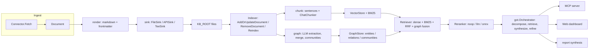

# Architectural Review: kb

Status: consolidated review prepared for the first public release (see the
plan `docs/plans/20260824-productize-and-publish-kb.md`).

`kb` is a self-contained, pure-Go GraphRAG knowledge base. It ingests
heterogeneous sources (code hosts, wikis, chats, task trackers, MCP servers,
files), renders them into a versioned corpus of markdown documents, builds a
hybrid retrieval index (dense vectors + in-memory BM25) and a temporal
knowledge graph (entities / relations / communities), and serves the result
through three surfaces: a CLI (`cmd/kb`), an MCP server (`internal/mcp`), and
a loopback web dashboard (`internal/web`). The only runtime external
dependency is LLM, used for chat and embeddings.

This document reviews the architecture as it exists today: what is strong,
what is risky, what is missing before the code can be published publicly, and
the concrete recommendations that the release plan turns into tasks. The
narrative pipeline description lives in `docs/architecture.md`; this review
focuses on the module map, seams, and the release-readiness assessment.

## System overview

The pipeline is a chain of fail-open stages. Each stage returns a partial
result plus an error; the caller degrades and never panics. The single
exception is the embedding dimension, which fails loudly on mismatch
(`ErrDimMismatch`) because a dimension change would silently corrupt every
vector.

Persistence is one SQLite file (`$PERSIST_DIR/kb.db`) that holds the vector
store (`chunks`), the knowledge graph (`entities` / `relations` /
`communities`), corpus metadata (`kb_meta` / `corpus_version`), and the
dashboard search/ask history (`search_history` / `ask_runs`). The BM25 index
is in-memory only and is rebuilt from `chunks` when `corpus_version` changes.

## Module map

| Package | Responsibility | Key seams and files |
|---|---|---|
| `cmd/kb` | CLI entrypoint and subcommands: `serve`, `sync`, `reindex`, `doctor`, `mcp`, `plan`, `describe`, `verify` | `cmd/kb/main.go`, `cmd/kb/connectors.go` |
| `internal/config` | Environment loading and `sources.yaml` parsing (env-var names only, values resolved via `EnvLookup`) | `internal/config` |
| `internal/llm` | LLM HTTP client: `Chat`, `ChatStream`, `Embed`, `Dim`; retry/backoff, timeout, proxy bypass via `KB_NO_PROXY` | `internal/llm/client.go`, `internal/llm/chat.go`, `internal/llm/embed.go` |
| `internal/transport` | Shared HTTP layer: pagers, retry/backoff, rate limit, ETag, SOCKS5 dialing | `internal/transport` |
| `internal/connector` | `Connector`, `Document`, `Cursor`, `Config`, `AuthSpec`, `FetchInfo`, and the `Sink` contract | `internal/connector/types.go` |
| `internal/connector/registry` | `map[type]Factory` registration and `New(type)` | `internal/connector/registry` |
| `internal/connectors/*` | Concrete connectors: GitHub, GitLab, wiki, MCP, chat (telegram/slack/mattermost), tracker (yandex/youtrack/kaiten/weeek/trello), searchapi, file, discord, blog (rss), web (sitemap/pages) | `internal/connectors` |
| `internal/render` | `Document` to markdown + YAML frontmatter | `internal/render` |
| `internal/sink` | `FileSink`, `APISink`, `TeeSink` implementations of `connector.Sink` | `internal/sink` |
| `internal/state` | Cursor state (`.sync-state.json`, advance-on-success + rollback) and tombstones (`.tombstones.json`) | `internal/state` |
| `internal/importer` | File importers (PDF, XLSX, JSON, SQL DDL, code, legalru) to `[]Document`; no network, no `Sink` | `internal/importer/importer.go`, `internal/importer/*` |
| `internal/ingest` | Sync driver loop; triggers `RefreshStaleCommunities` at batch end | `internal/ingest` |
| `internal/engine` | `Indexer` orchestration: chunk, embed, graph update, delete/reindex | `internal/engine/indexer.go` |
| `internal/engine/chunk` | Sentence-based chunker and thread-aware `ChatChunker` | `internal/engine/chunk` |
| `internal/engine/retriever` | Hybrid retrieval: dense multi-query + BM25 + RRF + authority prior + per-doc cap, then entity-linking and neighbor/community expansion | `internal/engine/retriever/retriever.go` |
| `internal/engine/rerank` | Optional `Reranker` implementations: noop, LLM, ONNX | `internal/engine/rerank` |
| `internal/engine/got` | Graph-of-Thoughts / LogicRAG orchestrator over the retriever | `internal/engine/got/orchestrator.go` |
| `internal/engine/report` | Answer synthesis and global GraphRAG reports | `internal/engine/report` |
| `internal/graph` | LLM entity/relation extraction, merge/dedup, community detection (Louvain / hierarchical Leiden), summaries, `GraphUpdater` | `internal/graph/extract.go`, `internal/graph/summary.go`, `internal/graph/updater.go`, `internal/graph/community.go`, `internal/graph/community_leiden.go` |
| `internal/store/vector` | `Store` contract for chunk/vector lifecycle, `Chunk`, `ScoredChunk` | `internal/store/vector/vector.go` |
| `internal/store/graphstore` | Graph `Store` contract: entities, relations, neighbors, communities, pruning, overlapping chunks, stale-community refresh | `internal/store/graphstore/graphstore.go` |
| `internal/store/sqlite` | `VectorStore`, `GraphStore`, `HistoryStore` implementations over `ncruces/go-sqlite3` (pure Go, no cgo) | `internal/store/sqlite` |
| `internal/store/bm25` | In-memory Okapi BM25, rebuild-on-write | `internal/store/bm25` |
| `internal/store/history` | Search/ask history `Store` contract and entry types | `internal/store/history/history.go` |
| `internal/mcp` | MCP server (stdio + HTTP), tools: search, ask, get_document, list_sources, add_note, add_source, graph_query, generate_report, reindex, status | `internal/mcp/server.go` |
| `internal/web` | Loopback dashboard: search/history, ask with SSE progress, documents and graph CRUD, integrations, reports, interactive Cytoscape graph, `/mcp/info` | `internal/web/server.go` |
| `internal/planner` | Agentic plan-execution loop for `kb plan` | `internal/planner` |
| `internal/governance` | Corpus scanning, retention, trash, apply | `internal/governance` |
| `internal/verify` | Verification layer: golden-graph diff, citation existence, contradiction detection, QA eval, legal faithfulness | `internal/verify/verify.go`, `internal/verify/citation.go`, `internal/verify/contradiction.go`, `internal/verify/qa`, `internal/verify/legaleval` |
| `internal/integration` | End-to-end tests: deterministic fake-LLM path (CI, no LLM) and LLM-gated live path | `internal/integration/e2e_fake_test.go`, `internal/integration/e2e_integration_test.go` |

## Data flow



## Dependency and seam diagram

The system avoids a single global LLM interface. Each consumer declares a
narrow local interface, satisfied by `*llm.Client` and replaced by fakes in
tests.

```mermaid
flowchart TD
    llm.Client --> engine.Indexer
    llm.Client --> retriever.Retriever
    llm.Client --> got.Orchestrator
    llm.Client --> graph.Extractor
    llm.Client --> graph.Summarizer
    llm.Client --> verify.ContradictionDetector

    subgraph Seams[Local interfaces]
        engine.Indexer -- Embedder --> V[Embed(ctx, model, texts) [][]float32]
        retriever.Retriever -- Embedder / BM25Searcher / GraphStore / ChatClient --> W
        got.Orchestrator -- ChatClient --> X[Chat(ctx, req) ChatResponse]
        graph.Extractor -- ChatClient --> Y
        graph.Summarizer -- ChatClient --> Z
    end

    sqlite.VectorStore -. implements .-> vector.Store
    sqlite.GraphStore -. implements .-> graphstore.Store
    sqlite.HistoryStore -. implements .-> history.Store
    FileSink/APISink/TeeSink -. implement .-> connector.Sink
```

The seams are deliberately small:

- `engine.Indexer` takes an `Embedder` (`internal/engine/indexer.go`) and an
  optional `*graph.GraphUpdater`; a nil embedder indexes BM25 only, a nil
  graph skips graph updates.
- `retriever.Retriever` takes `Embedder`, `BM25Searcher`, `GraphStore`, and
  `ChatClient` (`internal/engine/retriever/retriever.go`,
  `internal/engine/retriever/expand.go`, `internal/engine/retriever/graph.go`).
- `got.Orchestrator` and `graph.Extractor`/`graph.Summarizer` each declare a
  one-method `ChatClient` (`internal/engine/got/orchestrator.go`,
  `internal/graph/extract.go`, `internal/graph/summary.go`).
- Stores are interfaces (`internal/store/vector/vector.go`,
  `internal/store/graphstore/graphstore.go`, `internal/store/history/history.go`)
  implemented by `internal/store/sqlite`.
- `internal/llm.Client` injects `HTTPDoer`, clock/sleep, and jitter for
  transport-level tests without network (`internal/llm/client.go`).

## Strengths

- Dependency injection is pervasive and consistent. Every consumer of an
  external service declares a local interface, which makes the whole
  retrieval/reasoning stack testable offline.
- Fail-open is the rule at every stage except embedding dimension. Retrieval,
  LLM, rerank, and graph steps degrade to partial results instead of
  panicking, which keeps the dashboard and MCP server usable under a degraded
  model.
- The graph is bi-temporal. Relations carry `valid_from` / `valid_to`
  (real-world validity) alongside system `created_at` / `expired_at`; conflicts
  close the old edge rather than overwriting it, preserving an audit trail.
- The runtime stack is pure Go with no cgo (`ncruces/go-sqlite3`), which keeps
  builds simple and portable and enables a single-file SQLite persistence
  model.
- There is a real verification layer: golden-graph diff, citation existence,
  contradiction detection, QA evaluation, and legal faithfulness checks in
  `internal/verify`.
- Secrets are handled conservatively: `sources.yaml` stores only environment
  variable names; values are resolved at runtime via `EnvLookup`.

## Verification suite

The verifier layer in `internal/verify` is split into four independent checks,
each with an offline-friendly seam:

- Golden-graph diff (`verify.DiffGraph`) compares extracted entities and
  relations against a deterministic expectation, reporting missing, extra,
  and field-level mismatches. The fake e2e indexes a fixed fixture and asserts
  the resulting graph matches its golden graph.
- Citation integrity (`verify.CheckCitations`) resolves every parenthesized
  citation in an answer against the retrieved context chunks and flags
  unresolvable citations. The fake e2e asserts the GoT answer's citations all
  resolve and that at least one citation is present.
- Contradiction detection (`verify.ContradictionDetector`) asks an LLM to
  compare retrieved excerpts and returns explicit contradictions; it is
  fail-open and off by default in GoT.
- QA evaluation (`internal/verify/qa`) scores a golden closed-issue set with
  an LLM judge and a token-overlap fallback. The fallback path is exercised
  offline with no judge, proving `kb verify` scoring works without LLM.

## Risks

- The web dashboard is loopback-only with no authentication and exposes
  destructive routes (document/graph/integration mutation). This is an
  explicit prototype decision, not a bug, but it must be stated prominently in
  `SECURITY.md` before publication.
- The product couples to LLM for both embeddings and chat. The live
  LLM integration suite remains gated behind the `integration` build tag
  and `KB_LLM_IT=1`, so CI cannot run it; the offline fake-LLM e2e
  (`internal/integration/e2e_fake_test.go`) covers the same pipeline shape
  without a model and runs in CI.
- Coverage is uneven: 186 of 385 `.go` files have unit tests. The fake-LLM
  e2e is the only cross-package end-to-end test that runs offline; the live
  LLM e2e remains environment-gated.
- The single SQLite file and full BM25 rebuild-on-write are acceptable at
  prototype scale but are the first scalability ceilings: brute-force cosine
  search, in-memory BM25, and batch-only lazy community detection will not
  scale to a large corpus.
- Internal tooling artifacts and the private IP have been scrubbed from the
  tracked tree (IP replaced with `127.0.0.1`); the artifacts still remain in
  git history and require a fresh squashed publish, as noted below.

## Recommendations

The release plan (`docs/plans/20260824-productize-and-publish-kb.md`) maps the
review findings to concrete work:

| Recommendation | Task |
|---|---|
| Publish a consolidated architectural review (this document) | Task 1 |
| Add an importable deterministic fake-LLM testkit so the core pipeline can be exercised offline | Task 2 |
| Add a CI-runnable fake-LLM end-to-end test that reuses the existing integration structure | Task 3 |
| Wire the verifiers (citation, golden-graph diff, offline QA scoring) into the e2e | Task 4 |
| Add a GitHub Actions CI workflow on Go 1.26 | Task 5 |
| Add LICENSE + NOTICE, scrub the private IP and internal artifacts, polish the README, add CONTRIBUTING/SECURITY | Task 6 |
| Verify all acceptance criteria end to end | Task 8 |
| Prepare release docs and final artifacts | Task 9 |

The recommended publication hygiene is a fresh squashed initial commit (or
`git filter-repo`) rather than `git rm --cached` alone, because the internal
artifacts remain in git history.

## Public release readiness checklist

- LICENSE (Apache-2.0) and NOTICE present.
- CI workflow present and green without LLM.
- Deterministic fake-LLM e2e runs offline under `make check`.
- Verifier suite wired into the e2e and documented.
- Internal IP replaced across all tracked files.
- Internal tooling artifacts removed from the tracked tree; publish from a
  fresh squashed history so they are absent from git history.
- README rewritten as a product landing with quickstart from a clean clone.
- CONTRIBUTING and SECURITY documents present, including the loopback/no-auth
  warning.
- A clean clone contains no secrets, private IPs, or internal artifacts.

This checklist is the acceptance bar for the public release; Task 8 of the
plan verifies each item explicitly.
